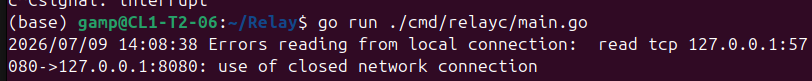

# Lessons Learned

A running log of significant bugs I've hit while building this project, the wrong assumptions that produced them and what I now understand. 

Each entry follows a symptom, wrong assumption that lead to it, then explanation of what i learnt and things i should note and try to avoid going forward in my journey

## Double close race on local Connection(in milestone2)
Anytime a request is made from the client side, i keep getting this error

### Wrong Assumption
i thought all clean shutdowns of localConn would return io.EOF from the pumps(tunnel) read and my EOF filter in writeLocalToTunnel will catch them. so any log firing mean something bad

### Correction
The pump's read can return two different errors depending on who(readFromTunnel or WriteLocaltoTunnel) closes the localConn first

So what happened was that when a request is sent to from the visitor to relayd, the OPEN Frame get sent to relayc which dials the localConn for that stream, then relayd sends the Data Frame, which relayc also sends its payload to the already opened local Connection. When localConnection finishes processing the request, it sends its response to relayc which then forward to relayd and from relayd to the visitor. Now this is where the race happened. when relayc (WriteLocaltoTunnel) sends the local server response, it loops back wait on localConn.Read for it to send the next chunk of bytes which in this case will be io.EOF because the local server has finished. But before the localConn could send the EOF, the visitor already sent closed to relayd after recieving the response from localConn, so relayd sent the CLOSE FRAME to relayc and relayc (specifically readFromTunnel), due to seeing tunnel.CLOSE already closed the localConn, whereas WriteLocaltoTunnel could still have been waiting for io.EOF from localConn(which could be slow due kernel operation, TCP FIN handshake etc), so immediately the kernel sees that the connection was closed(by the propagation from visitor connection closing), i get that error

So the solution is that i shouldn't have used only io.EOF to filter because it only works for the happy path, i should have also check for closed connection(net.ErrClosed), all in WriteLocaltoTunnel function

**Debugging move**: when I see an unexpected error from an operation on a shared resource, then one the first thing i should do is to count the number of goroutines that can Close it. More than one is a potential race.
